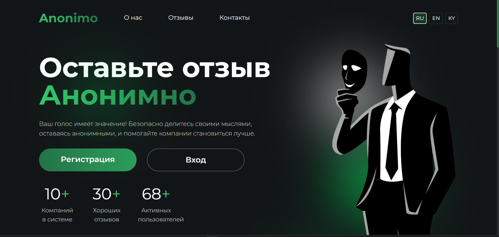
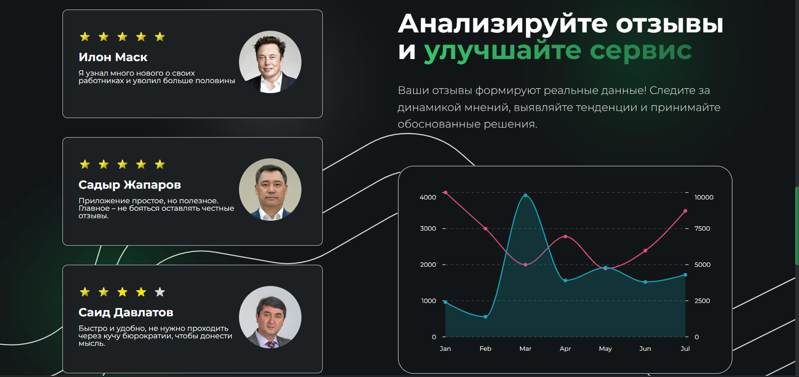

<!-- Баннер проекта -->


# Anonimo 
**Anonimo** — платформа для анонимных опросов, чатов и аналитики внутри компаний.  
Помогает улучшить командную коммуникацию и рабочую атмосферу через безопасное и анонимное взаимодействие.

---

## 🚀 Основные возможности
- Создание и управление анонимными опросами  
- Встроенные чаты для общения внутри команды  
- Генерация аналитических отчётов с визуализацией  
- AI-модуль для анализа данных и рекомендаций  
- Роли пользователей: админ и обычный сотрудник  
- Интеграция с PostgreSQL / MongoDB, развёртывание через Docker

---

## 🛠 Технологии
**Фронтенд:** React, TypeScript, Vite, Mantine, Zustand, Axios, React Hook Form  
**Бэкенд:** Java, Spring Boot  
**База данных:** PostgreSQL / MongoDB  
**Хостинг:** AWS / GCP / VPS  

---

## 📸 Скриншоты



---

## ⚡ Быстрый старт
```bash
git clone https://github.com/твой-репозиторий.git
cd frontend
npm install
npm run dev

cd ../backend
./mvnw spring-boot:run


